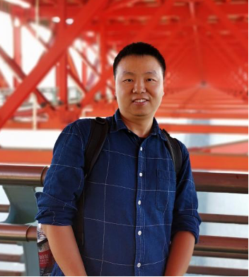
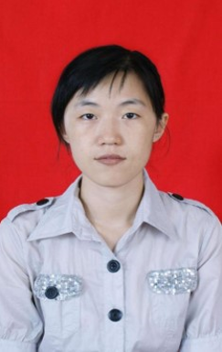
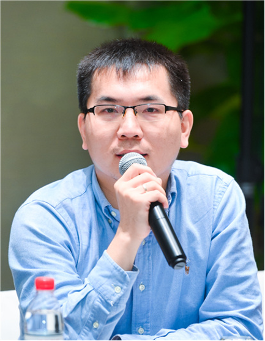
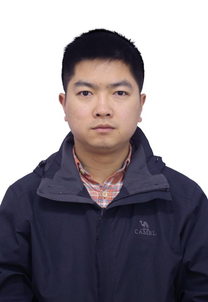
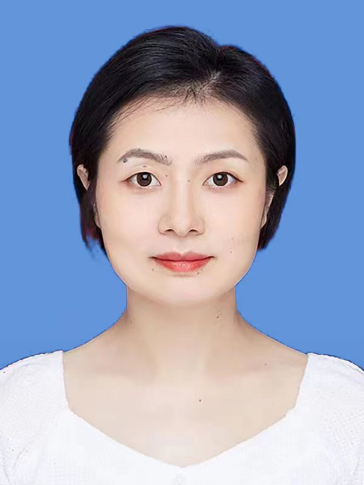
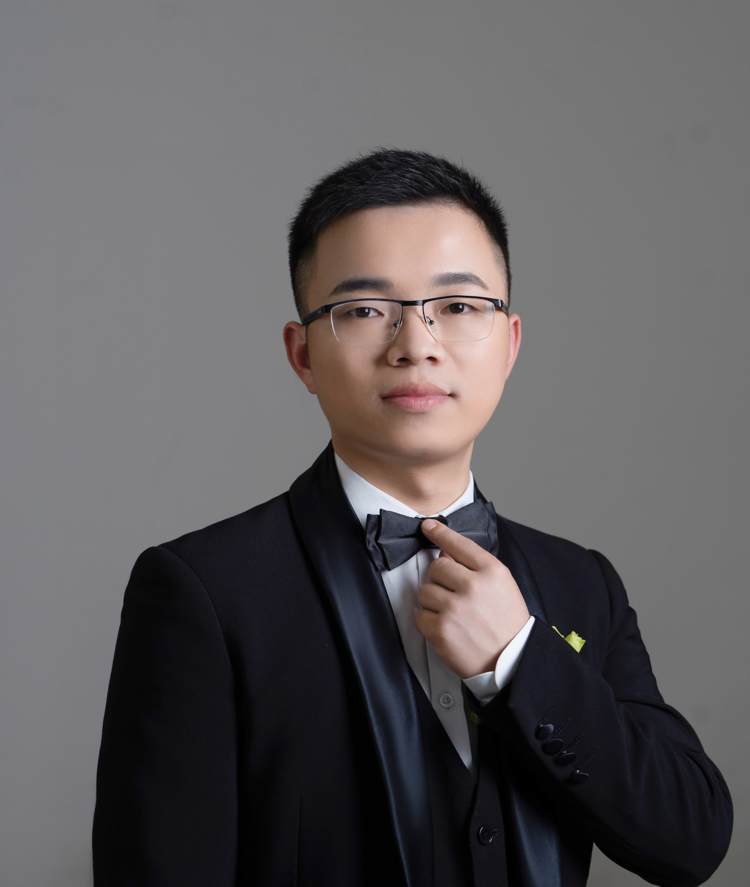

# Jie Yu 
 

Jie Yu obtained BS and PHD from National University of Defense Technology(NUDT) in 2005 and 2010 supervised by Prof. Huowang Chen and Prof. Zhoujun Li. He was a Post-graduate Internships in National University of Singapore supervised by Prof. Chang Ee-Chien during 2008-2009. Currently, he is a professor and a vice director of the center of system software in NUDT. He focus on system software, including security and performance in AI (mostly on NLP) and OS (mostly on Linux and Android). He has published more than 60 papers, including SIGCOMM, COLING, ICPP, SecureComm, ISPA etc.

Email:  yj[at]nudt.edu.cn

# Jun  Ma 
 

Jun Ma obtained his BS and PHD from National University of Defense Technology(NUDT) China in 2005 and 2011 supervised by Prof. Zhiying Wang. He is a associate research fellow in  Software Engineering Research Center of Computer School, NUDT. His research focuses on operating system(including architecture, kernel, security, desktop, etc), information security(including access control, trust computing, data leakage protection, data recovery, etc.), software engineering(including software ecosystem, dependency management, etc.). He has published more than 30 papers and made a lot of practical engineering systems on Linux, Windows and embedded systems.

Email: majun[at]nudt.edu.cn

# ShaSha Li 
 

Shasha Li obtained BS and PHD from National University of Defense Technology(NUDT) in 2005 and 2011 supervised by Prof. Huowang Chen and Prof. Zhoujun Li. She was a Post-graduate Internships in MSRA supervised by Prof. Chin-Yew Lin during 2008-2011. Currently, She is a associate professor of School of Computer Science in NUDT. She focus on natural language processing and knowledge graph. She has published more than 40 papers, including ACL, COLING, TKDE, IPM etc.

 Email: shashali[at]nudt.edu.cn

 #  XiaoDong Liu
 

 Xiaodong Liu received his BS and Ph.D in Computer Science and Technology from the National University of Defense Technology (NUDT), China in 2007 and 2013, respectively. Currently he works as an associate professor at NUDT and his research mainly focuses on desktop operating systems, software engineering and troubleshooting. 

 Email: liuxiaodong[at]nudt.edu.cn

 #  Long Peng

 

 Long Peng received his BS and MS in Computer Science and Technology from the National University of Defense Technology (NUDT), China in 2009 and 2012. After obtained his doctor degree in Engineering Sciences from Vrije Universiteit Brussel in 2017, he works as an assistant research fellow at NUDT. His research topics include real-time and mobile operating systems, embedded systems, robotics software frameworks and intelligent control systems.

 Email: penglong[at]nudt.edu.cn

# Jing Wang

Jing Wang received her BS and Ph.D in Computer Science and Technology from the National University of Defense Technology (NUDT), China in 2008 and 2019, respectively. Currently she works as an assistant research fellow at NUDT.Her research focuses on operating system，software engineering.

Email:wangjing[at]nudt.edu.cn

# Li zhuo

Zhuo Li received his PhD from the University of Chinese Academy of Sciences in 2023 supervised by Prof. Xu Zhou. He pursued a Joint PhD program in Ghent University supervised by Prof. Filip De Truck during 2021-2022. Currently, he works as a postdoctoral researcher at the National University of Defense Technology (NUDT) supervised by Prof. Jie Yu. His research focuses on intelligent operating systems, multi-agent systems, and reinforcement learning.

Email: lizhuo[at]nudt.edu.cn
